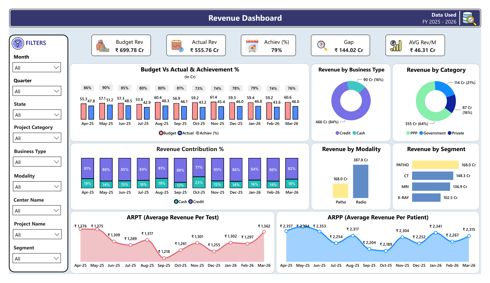
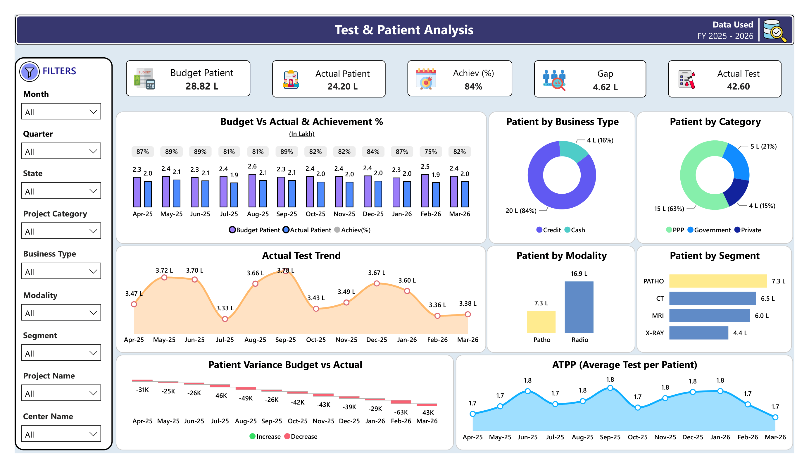
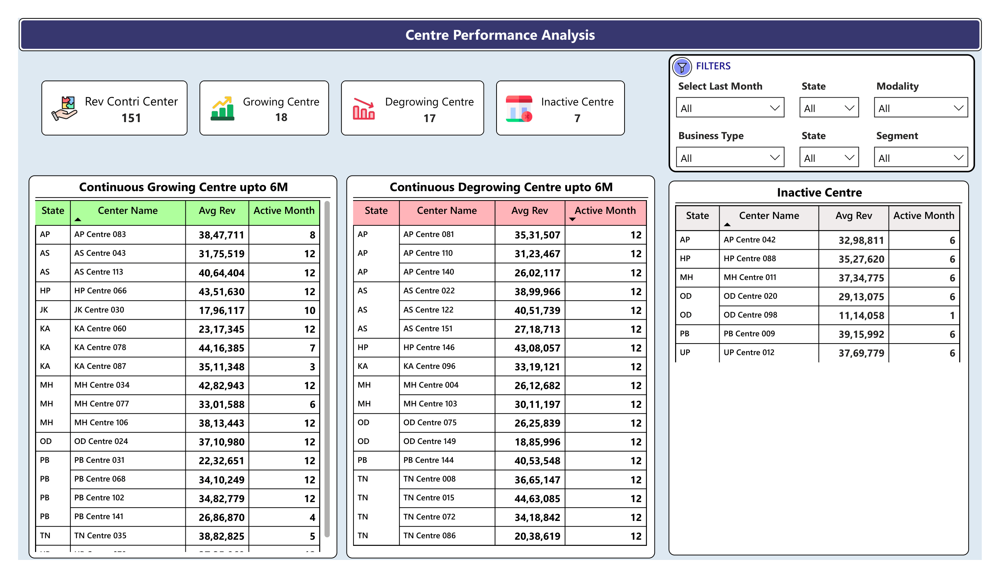
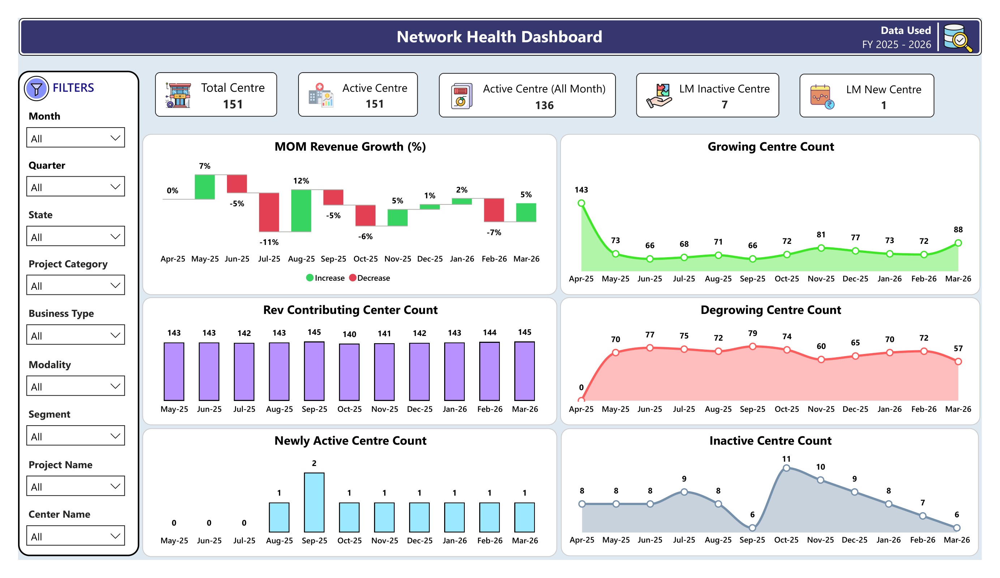

# 🏥 Healthcare Operations Performance Dashboard

## 📖 Overview

Healthcare organizations operate across multiple diagnostic centres and generate large volumes of operational, financial, patient, and test-related data every month.

This Power BI dashboard was designed to provide a centralized view of healthcare operations performance, enabling management teams to monitor key metrics, identify trends, and make data-driven decisions.

---

## 🎯 Business Problem

Management teams required a consolidated reporting solution to monitor:

- 💰 Revenue Performance
- 👥 Patient Volume Trends
- 🧪 Test Volume Trends
- 🏢 Centre Performance
- 📈 Growth & Decline Analysis
- 🌐 Network Health Monitoring

Without a centralized dashboard, performance tracking relied on multiple reports and manual analysis, making timely decision-making difficult.

---

## 💡 Solution

A multi-page Power BI dashboard was developed to provide a single source of truth for healthcare operations performance.

The solution combines financial, operational, and network-level KPIs into one interactive reporting platform.

---

## 🚀 Dashboard Objectives

- 📊 Monitor revenue performance against targets
- 👥 Analyze patient and test volume trends
- 🏢 Evaluate centre-level performance
- 📈 Identify growing and degrowing centres
- 🔍 Detect inactive centres
- 🌐 Monitor network health and expansion
- 🎯 Support data-driven decision-making

---

## 📄 Dashboard Pages

### 1. 💰 Revenue Performance Overview

**Key Insights**
- Revenue KPIs
- Budget vs Actual Analysis
- Revenue Contribution Analysis
- Modality & Segment Performance
- ARPP & ARPT Trends

**Business Value**
- Improves financial visibility
- Identifies revenue drivers
- Supports growth planning

---

### 2. 👥 Patient & Test Analytics

**Key Insights**
- Patient Volume Trends
- Test Volume Trends
- ATPP Analysis
- Segment-wise Performance
- Modality-wise Analysis

**Business Value**
- Supports demand forecasting
- Improves resource planning
- Enhances operational monitoring

---

### 3. 📈 Centre Performance Analysis

**Key Insights**
- Growing Centres
- Degrowing Centres
- Inactive Centres
- Revenue Contribution Analysis

**Business Value**
- Identifies high-performing centres
- Detects underperforming locations
- Supports performance improvement initiatives

---

### 4. 🌐 Network Health Dashboard

**Key Insights**
- Total Centres
- Active Centres
- Revenue Contributing Centres
- Newly Active Centres
- Inactive Centres

**Business Value**
- Tracks network expansion
- Monitors operational coverage
- Evaluates network stability

---

## 📌 KPIs Tracked

- 💰 Revenue
- 🎯 Budget Achievement %
- 📉 Revenue Gap
- 👥 Patient Count
- 🧪 Test Count
- 📈 ARPP
- 📈 ARPT
- 📈 ATPP
- 🏢 Active Centres
- 🌐 Revenue Contributing Centres
- 🆕 Newly Active Centres
- ⚠️ Inactive Centres
- 📈 Growing Centres
- 📉 Degrowing Centres

---

## 🛠️ Tools & Technologies

- Power BI
- DAX
- Power Query
- Microsoft Excel
- Data Modelling
- Business Intelligence

---

## 🔒 Data Privacy & Disclaimer

This dashboard has been recreated using a simulated dataset for portfolio and demonstration purposes.

The original dashboard was developed using organizational healthcare operations data. Due to confidentiality and data privacy requirements, actual business data cannot be publicly shared.

All visualizations, KPIs, calculations, and business logic have been preserved while using representative dummy data.

---

## 📂 Dataset

The repository includes a sample dataset created specifically for portfolio demonstration purposes.

No actual organizational data, patient information, financial records, or confidential business information has been used.

---

## 📸 Dashboard Preview

### 💰 Revenue Performance Overview

This page provides a comprehensive view of financial performance across the healthcare network. It enables management to monitor revenue achievement against targets, analyze revenue contribution across business segments and modalities, and evaluate key financial performance indicators. The dashboard supports revenue trend analysis and helps identify major revenue drivers across the organization.

---

### 👥 Patient & Test Analytics

This page focuses on operational performance by analyzing patient and test volumes across the healthcare network. It helps management understand service utilization patterns, monitor ATPP trends, evaluate modality performance, and identify demand trends that support operational planning and resource allocation.

---

### 📈 Centre Performance Analysis

This page provides centre-level performance monitoring by identifying growing, degrowing, and inactive centres. It enables management teams to evaluate operational performance, detect underperforming locations, and identify centres that require strategic intervention or improvement initiatives.

---

### 🌐 Network Health Dashboard

This page provides an overall view of network performance and operational coverage. It helps management monitor active centres, revenue-contributing centres, newly active centres, inactive centres, and overall network stability. The dashboard supports strategic decision-making related to network expansion and operational effectiveness.

---
## 📈 Business Impact

This dashboard provides management teams with a centralized reporting solution for monitoring operational and financial performance across the healthcare network.

By consolidating key metrics into a single analytical platform, the solution improves visibility, reduces manual reporting effort, and enables faster data-driven decision-making.
